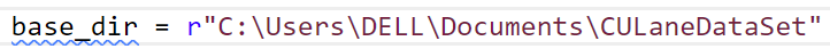
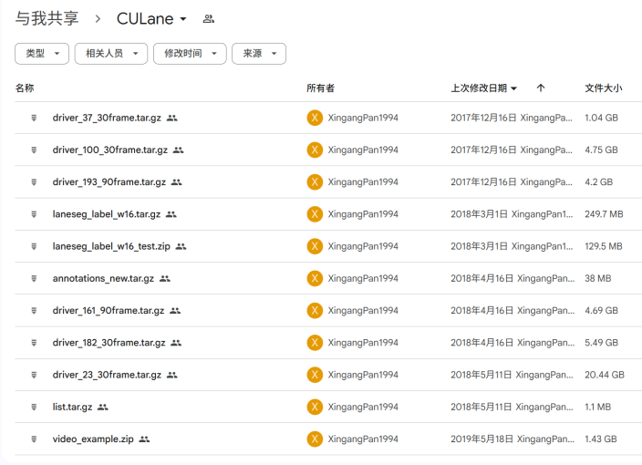
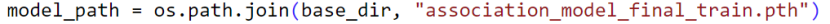
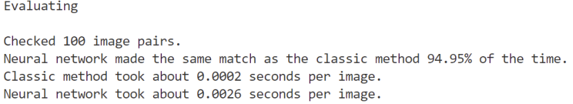
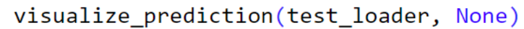
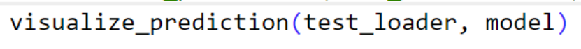
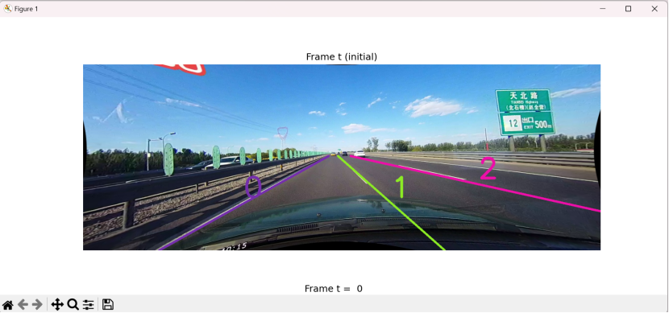
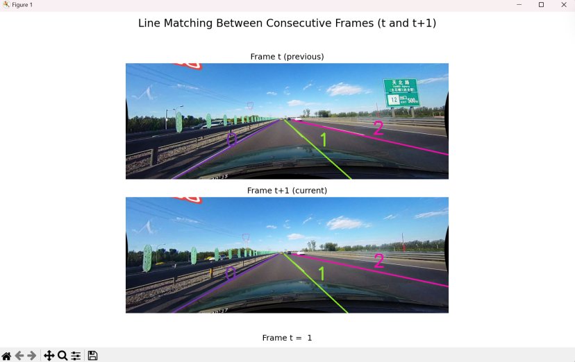

# Line-association-using-neural-network

In the github repository the image.png files are used in this readme document.

User guide:

First please download the python file:Line association using neural network.py 

1.Test Purpose 

    If you do not want to download the full CULane dataset (since it is quite large), I have provided a sample version instead. You can find it at the following path in my github repositoy:
    ...\Line association using neural network\testSample\CULaneDataset

    After you find the path,then substitue the base_dir path.
    

    This sample CULane dataset includes everything needed to run the program, but only contains a minimal amount of data.
    It is only intended for the purpose of testing visualization and evaluation.

2.Train line association model from scrach:
    
    1).Download the CULane dataset
    Visit the official CULane dataset link:
    https://drive.google.com/drive/folders/1mSLgwVTiaUMAb4AVOWwlCD5JcWdrwpvu

    2).Verify the dataset
    After opening the link, make sure the file structure matches the screenshot below.If it matches, proceed to download the entire dataset.
    

    3).Set up the data path
    In your code, locate the base_dir variable and update it to the full path where the CULane dataset is located on your machine.
    

    4).Specify the model path
    Set the model_path variable to your preferred filename.The trained model will be saved to this path after training is completed.
    
    Once these steps are done, you can run the script with train = True to start training the neural line association model from scratch.

3.Use a Pretrained Line Association Model (Provided)

    If you prefer not to train the model from scratch, you can use the pretrained model file that is included/provided with the project:association_model_2025_5_22 . Follow the steps below to set it up :
    
    1).Place the pretrained model 
    Copy the provided model file (e.g., association_model_final.pth) to your desired directory.

    2).Update the model path in the code
    Open your script and set the model_path variable to the full path of the model file you just placed.
    
    3)Set execution flags
    In the if __name__ == "__main__": block, make sure:train = False

4.Evaluate Line Association model

   To evaluate and compare the performance between the classic rule-based method and the neural network model, set:evaluate = True
    Please note that evaluation requires a trained model. You must have either:Just trained the neural model (train = True), or valid pretrained model file at the path specified by model_path
    When it trigger the evaluation pipeline, it will show report inside terminal as following:
    

5.Visualize Lines matches between consecutive frames

   This project supports visualizing matched lane lines between consecutive video frames using either the classic rule-based method or the neural network model.
   
    1). To visualize classic matches:Simply set the model to None  
    

    2)To visualize neural network matches:
    You must either have just trained the model (train = True), or provide a pretrained model file and set the correct model_path.
    

    Visual results are displayed using matplotlib, showing two consecutive frames:

    Frame t (previous)
    Frame t+1 (current)

    Matched line pairs are drawn in the same color and labeled with a consistent ID, allowing easy visual tracking across frames.

    On the first frame, no previous lines exist to match — the system will only initialize and assign IDs to each line in the first frame.
    
    To view the next pair of frames, you must close the current figure window (click the ❌ "X" in the top corner).
    Once the current figure is closed, the next visualization will automatically be displayed.

    
    If you do not want to continue visualize more pairs of frame,you can stop the program earlier in the terminal press:ctrl + c to stop the program.
